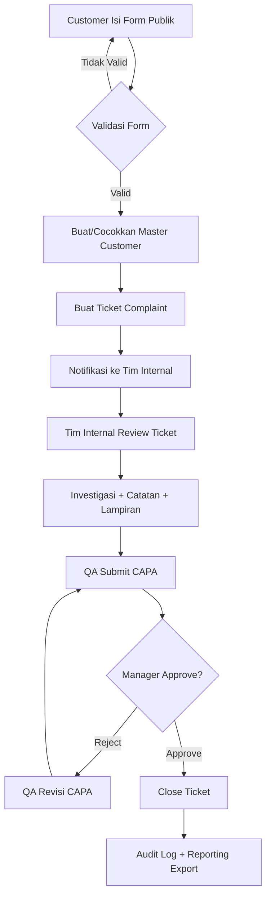
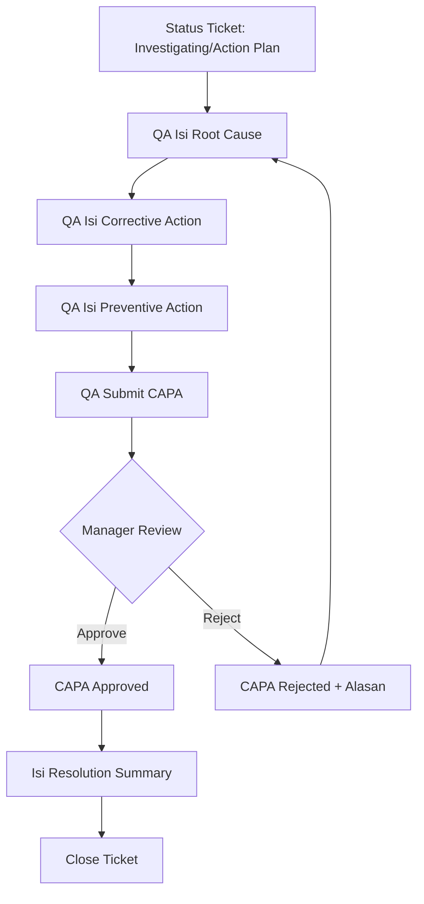
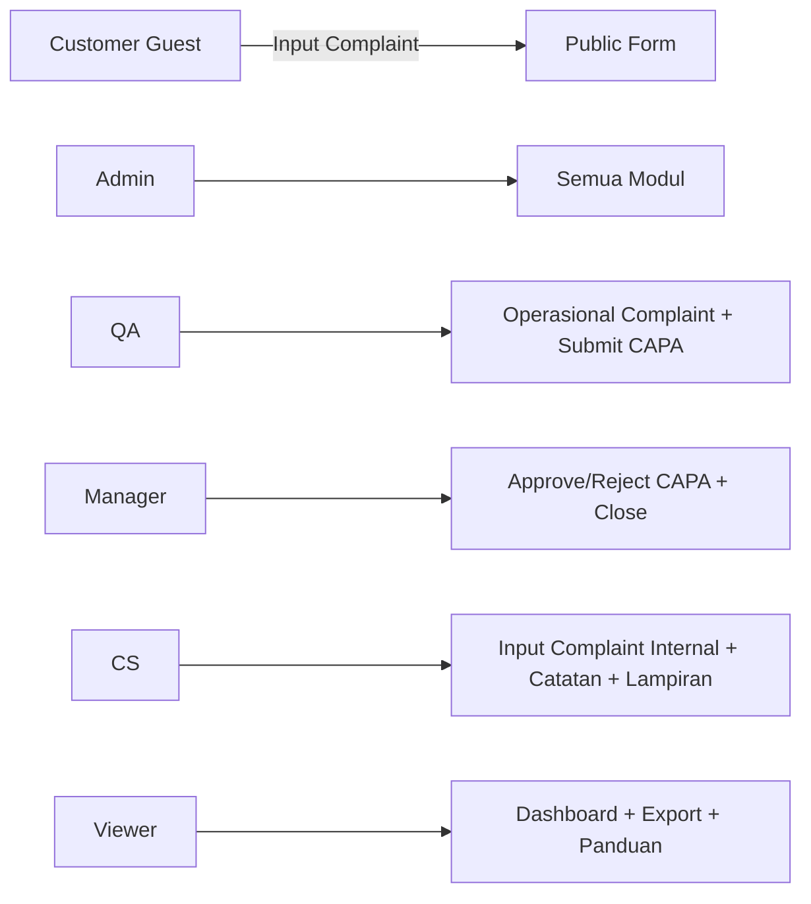

# Flow Proses dan Flowchart Sistem CRM Complaint

Tanggal update: 2 Maret 2026

## 1. Flow Proses End-to-End
1. Customer mengisi form complaint publik (`/` atau `/complaint-form`) tanpa login.
2. Sistem validasi data, membuat/mencocokkan data customer, lalu membuat ticket complaint.
3. Sistem kirim notifikasi ke tim internal (Admin/Manager/QA/CS).
4. Tim internal login, membuka daftar complaint, lalu memproses detail ticket.
5. Tim menambahkan catatan investigasi dan upload bukti jika diperlukan.
6. QA menyiapkan CAPA dan submit ke Manager.
7. Manager review CAPA:
8. Jika ditolak: QA revisi CAPA lalu submit ulang.
9. Jika disetujui: ticket bisa ditutup (Close) oleh QA/Manager/Admin.
10. Semua aksi terekam di audit log.
11. Data dapat diekspor ke Excel/PDF untuk pelaporan.

## 2. Flowchart Utama (Mermaid)

## 3. Flowchart CAPA Detail

## 4. Flow Role Akses

## 5. Master Data Governance
1. Master Data (`Brand`, `Category`, `Severity`, `Customer`) hanya dapat dikelola oleh `Admin`.
2. Input complaint internal menggunakan referensi master data.
3. Pilihan customer pada form internal bersifat searchable agar cepat untuk data besar.

## 6. Output dan Kontrol
1. Output operasional: status ticket, timeline, CAPA status.
2. Output manajerial: KPI dashboard, export Excel/PDF.
3. Kontrol kepatuhan: audit log seluruh aksi penting.
